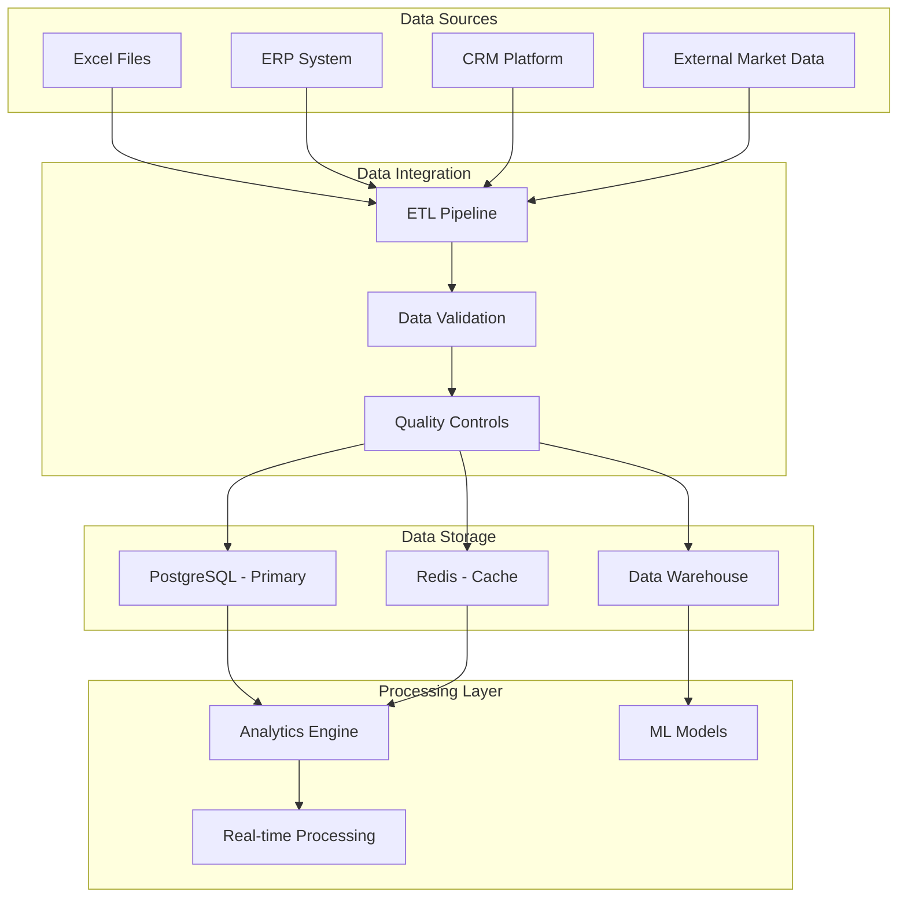

# 🏗️ Technical Architecture & Integration Strategy

## System Architecture Overview

### Current State Assessment
```
Existing Infrastructure:
- Excel-based data processing (manual)
- Limited analytical capabilities
- No real-time insights
- Siloed data sources
```

### Target Architecture
```
Future State Vision:
- Integrated data platform
- Real-time analytics
- Predictive capabilities
- Mobile-first accessibility
- Cloud-native scalability
```

---

## 🏛️ Technical Architecture Blueprint

### 📊 Data Layer Architecture



### 🖥️ Application Architecture

```
Frontend Layer:
┌─────────────────────────────────────────────────────────────┐
│ React.js Dashboard (Mobile Responsive)                  │
├─────────────────────────────────────────────────────────────┤
│ Executive View  │ Management View  │ Analytics View      │
├─────────────────────────────────────────────────────────────┤
│ Real-time Charts │ Interactive Maps │ Custom Reports      │
└─────────────────────────────────────────────────────────────┘

API Gateway Layer:
┌─────────────────────────────────────────────────────────────┐
│ FastAPI Gateway (Authentication, Rate Limiting)         │
├─────────────────────────────────────────────────────────────┤
│ /api/sales  │ /api/analytics  │ /api/alerts         │
│ /api/markets │ /api/forecast   │ /api/reports        │
└─────────────────────────────────────────────────────────────┘

Business Logic Layer:
┌─────────────────────────────────────────────────────────────┐
│ Python Microservices                                    │
├─────────────────────────────────────────────────────────────┤
│ Analytics Service │ Forecast Service │ Alert Service      │
│ Data Service     │ Report Service   │ User Service        │
└─────────────────────────────────────────────────────────────┘
```

---

## 🔄 Data Integration Strategy

### Phase 1: Foundation (0-3 months)
```python
# Excel Processing Pipeline
class ExcelDataProcessor:
    def __init__(self):
        self.source_path = "DUMMY DATA FOR PRECISION AREAS.xlsx"
        self.validation_rules = self._load_validation_rules()
        
    def process_daily_updates(self):
        """Process daily Excel updates with validation"""
        # Data extraction
        raw_data = self._extract_excel_data()
        
        # Data validation
        validated_data = self._validate_data(raw_data)
        
        # Data transformation
        transformed_data = self._transform_data(validated_data)
        
        # Database loading
        self._load_to_database(transformed_data)
        
        # Quality checks
        self._run_quality_checks()
        
    def _extract_excel_data(self) -> pd.DataFrame:
        """Extract data from Excel file"""
        return pd.read_excel(self.source_path, sheet_name='Sheet6')
        
    def _validate_data(self, df: pd.DataFrame) -> pd.DataFrame:
        """Validate data against business rules"""
        # Check for missing values
        # Validate data types
        # Check business rule compliance
        return df
```

### Phase 2: Advanced Integration (3-9 months)
```python
# Multi-Source Data Integration
class IntegratedDataProcessor:
    def __init__(self):
        self.sources = {
            'excel': ExcelDataProcessor(),
            'erp': ERPConnector(),
            'crm': CRMConnector(),
            'external': ExternalDataConnector()
        }
        
    async def process_all_sources(self):
        """Process data from all sources"""
        tasks = [
            self.sources['excel'].process_daily_updates(),
            self.sources['erp'].fetch_sales_data(),
            self.sources['crm'].fetch_customer_data(),
            self.sources['external'].fetch_market_data()
        ]
        
        results = await asyncio.gather(*tasks)
        
        # Merge and deduplicate
        integrated_data = self._merge_data_sources(results)
        
        # Store in data warehouse
        await self._store_integrated_data(integrated_data)
```

### Phase 3: Real-time Integration (9-18 months)
```python
# Real-time Data Streaming
class RealTimeDataProcessor:
    def __init__(self):
        self.kafka_consumer = KafkaConsumer()
        self.redis_client = RedisClient()
        self.websocket_manager = WebSocketManager()
        
    async def process_real_time_data(self):
        """Process real-time data streams"""
        async for message in self.kafka_consumer:
            # Parse incoming data
            data = self._parse_message(message)
            
            # Validate and enrich
            enriched_data = await self._enrich_data(data)
            
            # Store in cache for quick access
            await self.redis_client.setex(
                f"realtime:{data['type']}", 
                300, 
                json.dumps(enriched_data)
            )
            
            # Broadcast to connected clients
            await self.websocket_manager.broadcast(enriched_data)
```

---

## 🎯 Analytics Engine Architecture

### Core Analytics Components

```python
# Analytics Engine Core
class AnalyticsEngine:
    def __init__(self):
        self.database = DatabaseConnection()
        self.cache = RedisClient()
        self.ml_models = MLModelManager()
        
    # Distribution Gap Analysis
    async def analyze_distribution_gaps(self) -> Dict:
        """Analyze zero-sales patterns and opportunities"""
        query = """
            SELECT region, province, precision_area, pack_type, 
                   COUNT(*) as total_records,
                   SUM(CASE WHEN sales = 0 THEN 1 ELSE 0 END) as zero_records
            FROM sales_data 
            WHERE sales_date >= CURRENT_DATE - INTERVAL '30 days'
            GROUP BY region, province, precision_area, pack_type
        """
        
        results = await self.database.execute(query)
        
        # Calculate gap percentages
        gap_analysis = {}
        for row in results:
            gap_percentage = (row['zero_records'] / row['total_records']) * 100
            if gap_percentage > 40:  # Critical threshold
                gap_analysis[f"{row['region']}_{row['pack_type']}"] = {
                    'gap_percentage': gap_percentage,
                    'urgency': 'HIGH' if gap_percentage > 60 else 'MEDIUM',
                    'recommendation': self._generate_gap_recommendation(row, gap_percentage)
                }
        
        return gap_analysis
    
    # Market Trend Analysis
    async def analyze_market_trends(self, period: str = 'monthly') -> Dict:
        """Analyze market trends and patterns"""
        query = self._build_trend_query(period)
        results = await self.database.execute(query)
        
        # Calculate growth rates and trends
        trend_analysis = self._calculate_trends(results)
        
        # Identify anomalies and opportunities
        opportunities = self._identify_opportunities(trend_analysis)
        
        return {
            'trends': trend_analysis,
            'opportunities': opportunities,
            'recommendations': self._generate_trend_recommendations(opportunities)
        }
    
    # Predictive Analytics
    async def generate_forecasts(self, horizon: int = 90) -> Dict:
        """Generate demand forecasts using ML models"""
        historical_data = await self._get_historical_data()
        
        # Use pre-trained models
        forecasts = {}
        for model_name, model in self.ml_models.get_models():
            model_forecast = await model.predict(historical_data, horizon)
            forecasts[model_name] = {
                'predictions': model_forecast,
                'confidence': model.get_confidence(),
                'accuracy': model.get_historical_accuracy()
            }
        
        # Ensemble forecasts
        ensemble_forecast = self._ensemble_forecasts(forecasts)
        
        return {
            'individual_models': forecasts,
            'ensemble': ensemble_forecast,
            'recommendations': self._generate_forecast_recommendations(ensemble_forecast)
        }
```

### Machine Learning Pipeline

```python
# ML Pipeline for Predictive Analytics
class MLPipeline:
    def __init__(self):
        self.feature_engineer = FeatureEngineer()
        self.model_trainer = ModelTrainer()
        self.model_registry = ModelRegistry()
        
    async def train_demand_forecast_model(self):
        """Train demand forecasting model"""
        # Get training data
        training_data = await self._get_training_data()
        
        # Feature engineering
        features = self.feature_engineer.create_features(training_data)
        
        # Train multiple models
        models = {
            'linear_regression': self._train_linear_model(features),
            'random_forest': self._train_random_forest(features),
            'lstm': self._train_lstm_model(features),
            'prophet': self._train_prophet_model(features)
        }
        
        # Evaluate and select best model
        best_model = self._evaluate_models(models)
        
        # Register model
        await self.model_registry.register_model('demand_forecast', best_model)
        
        return best_model
    
    def _create_features(self, data: pd.DataFrame) -> pd.DataFrame:
        """Create features for ML models"""
        features = data.copy()
        
        # Time-based features
        features['month'] = pd.to_datetime(features['date']).dt.month
        features['quarter'] = pd.to_datetime(features['date']).dt.quarter
        features['is_ramadan'] = features['month'].apply(lambda x: 1 if x == 10 else 0)
        
        # Lag features
        for lag in [1, 2, 3, 7, 30]:
            features[f'sales_lag_{lag}'] = features.groupby(['region', 'product'])['sales'].shift(lag)
        
        # Rolling features
        for window in [7, 30, 90]:
            features[f'sales_rolling_{window}'] = features.groupby(['region', 'product'])['sales'].rolling(window).mean()
        
        return features
```

---

## 📱 Mobile & Real-time Architecture

### Progressive Web App (PWA)

```typescript
// Mobile-First PWA Architecture
interface MobileApp {
  // Service Worker for Offline Support
  serviceWorker: ServiceWorkerManager;
  
  // Real-time Data Sync
  dataSync: RealTimeSync;
  
  // Offline Storage
  offlineStorage: OfflineStorageManager;
  
  // Push Notifications
  notifications: PushNotificationManager;
}

class PWAAnalyticsView {
  constructor() {
    this.initializeOfflineSupport();
    this.setupRealtimeSync();
    this.configurePushNotifications();
  }
  
  async loadDashboardData() {
    try {
      // Try online data first
      const onlineData = await this.fetchOnlineData();
      return onlineData;
    } catch (error) {
      // Fall back to offline data
      return this.offlineStorage.getDashboardData();
    }
  }
  
  setupRealtimeSync() {
    // WebSocket connection for real-time updates
    this.websocket = new WebSocket(WS_URL);
    
    this.websocket.onmessage = (event) => {
      const data = JSON.parse(event.data);
      
      // Update UI
      this.updateDashboard(data);
      
      // Cache for offline use
      this.offlineStorage.cacheData(data);
    };
  }
}
```

### Real-time Alert System

```python
# Real-time Alert Processing
class AlertSystem:
    def __init__(self):
        self.redis_client = RedisClient()
        self.websocket_manager = WebSocketManager()
        self.email_service = EmailService()
        self.sms_service = SMSService()
        
    async def process_alerts(self):
        """Process real-time alerts and notifications"""
        while True:
            # Check for new alerts
            alerts = await self._check_alert_conditions()
            
            for alert in alerts:
                # Prioritize alerts
                priority = self._calculate_priority(alert)
                
                # Route to appropriate channels
                if priority == 'CRITICAL':
                    await self._send_critical_alert(alert)
                elif priority == 'HIGH':
                    await self._send_high_priority_alert(alert)
                else:
                    await self._send_information_alert(alert)
                
                # Track alert
                await self._log_alert(alert, priority)
            
            await asyncio.sleep(60)  # Check every minute
    
    async def _check_alert_conditions(self) -> List[Dict]:
        """Check conditions that trigger alerts"""
        alerts = []
        
        # Check for distribution gaps
        gap_alerts = await self._check_distribution_gaps()
        alerts.extend(gap_alerts)
        
        # Check for market share erosion
        erosion_alerts = await self._check_market_share_erosion()
        alerts.extend(erosion_alerts)
        
        # Check for forecast deviations
        forecast_alerts = await self._check_forecast_deviations()
        alerts.extend(forecast_alerts)
        
        return alerts
```

---

## 🔒 Security & Compliance Architecture

### Authentication & Authorization

```python
# Security Implementation
class SecurityManager:
    def __init__(self):
        self.jwt_manager = JWTManager()
        self.rbac_manager = RBACManager()
        self.audit_logger = AuditLogger()
        
    async def authenticate_user(self, credentials: Dict) -> Dict:
        """Authenticate user and return JWT token"""
        try:
            # Validate credentials
            user = await self._validate_credentials(credentials)
            
            # Check user permissions
            permissions = await self.rbac_manager.get_user_permissions(user['id'])
            
            # Generate JWT token
            token = self.jwt_manager.generate_token({
                'user_id': user['id'],
                'permissions': permissions,
                'exp': datetime.now() + timedelta(hours=24)
            })
            
            # Log authentication
            await self.audit_logger.log_event({
                'event_type': 'AUTHENTICATION',
                'user_id': user['id'],
                'timestamp': datetime.now(),
                'ip_address': credentials.get('ip_address'),
                'success': True
            })
            
            return {'token': token, 'permissions': permissions}
            
        except Exception as e:
            await self.audit_logger.log_event({
                'event_type': 'AUTHENTICATION_FAILED',
                'timestamp': datetime.now(),
                'ip_address': credentials.get('ip_address'),
                'error': str(e)
            })
            raise AuthenticationError("Invalid credentials")
    
    async def check_permission(self, token: str, resource: str, action: str) -> bool:
        """Check if user has permission for specific action"""
        try:
            # Decode token
            payload = self.jwt_manager.decode_token(token)
            
            # Check permissions
            has_permission = await self.rbac_manager.check_permission(
                payload['user_id'], 
                resource, 
                action
            )
            
            # Log access attempt
            await self.audit_logger.log_event({
                'event_type': 'PERMISSION_CHECK',
                'user_id': payload['user_id'],
                'resource': resource,
                'action': action,
                'permitted': has_permission,
                'timestamp': datetime.now()
            })
            
            return has_permission
            
        except Exception as e:
            await self.audit_logger.log_event({
                'event_type': 'PERMISSION_CHECK_FAILED',
                'error': str(e),
                'timestamp': datetime.now()
            })
            return False
```

### Data Protection & Privacy

```python
# Data Protection Implementation
class DataProtectionManager:
    def __init__(self):
        self.encryption_key = self._load_encryption_key()
        self.cipher_suite = Fernet(self.encryption_key)
        this.masking_engineer = DataMaskingEngine()
        
    def encrypt_sensitive_data(self, data: str) -> str:
        """Encrypt sensitive data"""
        return self.cipher_suite.encrypt(data.encode()).decode()
    
    def decrypt_sensitive_data(self, encrypted_data: str) -> str:
        """Decrypt sensitive data"""
        return self.cipher_suite.decrypt(encrypted_data.encode()).decode()
    
    def mask_pii_data(self, data: Dict) -> Dict:
        """Mask personally identifiable information"""
        masked_data = data.copy()
        
        # Mask customer names
        if 'customer_name' in masked_data:
            masked_data['customer_name'] = self.masking_engineer.mask_name(
                masked_data['customer_name']
            )
        
        # Mask phone numbers
        if 'phone_number' in masked_data:
            masked_data['phone_number'] = self.masking_engineer.mask_phone(
                masked_data['phone_number']
            )
        
        # Mask email addresses
        if 'email' in masked_data:
            masked_data['email'] = self.masking_engineer.mask_email(
                masked_data['email']
            )
        
        return masked_data
    
    def apply_data_retention_policy(self, data: Dict) -> bool:
        """Apply data retention policies"""
        creation_date = data.get('created_at')
        if not creation_date:
            return False
        
        # Check retention period (e.g., 7 years for transaction data)
        retention_period = timedelta(days=7*365)
        if datetime.now() - creation_date > retention_period:
            return False  # Should be archived/deleted
        
        return True
```

---

## 🚀 Deployment & Infrastructure

### Cloud-Native Deployment

```yaml
# Kubernetes Deployment Configuration
apiVersion: apps/v1
kind: Deployment
metadata:
  name: csd-analytics-api
spec:
  replicas: 3
  selector:
    matchLabels:
      app: csd-analytics-api
  template:
    metadata:
      labels:
        app: csd-analytics-api
    spec:
      containers:
      - name: api
        image: csd-analytics:latest
        ports:
        - containerPort: 8000
        env:
        - name: DATABASE_URL
          valueFrom:
            secretKeyRef:
              name: csd-secrets
              key: database-url
        - name: REDIS_URL
          valueFrom:
            secretKeyRef:
              name: csd-secrets
              key: redis-url
        resources:
          requests:
            memory: "512Mi"
            cpu: "500m"
          limits:
            memory: "1Gi"
            cpu: "1000m"
        livenessProbe:
          httpGet:
            path: /health
            port: 8000
          initialDelaySeconds: 30
          periodSeconds: 10
        readinessProbe:
          httpGet:
            path: /ready
            port: 8000
          initialDelaySeconds: 5
          periodSeconds: 5
---
apiVersion: v1
kind: Service
metadata:
  name: csd-analytics-service
spec:
  selector:
    app: csd-analytics-api
  ports:
  - protocol: TCP
    port: 80
    targetPort: 8000
  type: LoadBalancer
```

### Infrastructure Monitoring

```python
# Monitoring and Observability
class MonitoringSystem:
    def __init__(self):
        self.metrics_collector = MetricsCollector()
        self.alerting_system = AlertingSystem()
        self.log_aggregator = LogAggregator()
        
    async def collect_application_metrics(self):
        """Collect application performance metrics"""
        while True:
            # CPU and Memory usage
            system_metrics = self._get_system_metrics()
            await self.metrics_collector.record_metrics(system_metrics)
            
            # API response times
            api_metrics = await self._get_api_metrics()
            await self.metrics_collector.record_metrics(api_metrics)
            
            # Database performance
            db_metrics = await self._get_database_metrics()
            await self.metrics_collector.record_metrics(db_metrics)
            
            # Check for anomalies
            anomalies = await self._detect_anomalies()
            for anomaly in anomalies:
                await self.alerting_system.send_alert(anomaly)
            
            await asyncio.sleep(60)  # Collect every minute
    
    async def check_service_health(self):
        """Check health of all services"""
        services = {
            'api': self._check_api_health(),
            'database': self._check_database_health(),
            'redis': self._check_redis_health(),
            'external_apis': await self._check_external_api_health()
        }
        
        overall_health = all(services.values())
        
        await self.metrics_collector.record_health_check({
            'timestamp': datetime.now(),
            'services': services,
            'overall_health': overall_health
        })
        
        return overall_health
```

---

## 🔄 Integration & Migration Strategy

### Phase-wise Implementation

```python
# Migration Strategy Implementation
class MigrationManager:
    def __init__(self):
        self.phases = {
            'phase1': self.phase1_foundation,
            'phase2': self.phase2_integration,
            'phase3': self.phase3_transformation
        }
        self.current_phase = 'phase1'
        
    async def execute_migration(self):
        """Execute phased migration"""
        for phase_name, phase_handler in self.phases.items():
            print(f"Starting {phase_name}")
            
            try:
                await phase_handler()
                print(f"Completed {phase_name}")
                
                # Wait for approval before next phase
                await self._wait_for_phase_approval()
                
            except Exception as e:
                print(f"Failed {phase_name}: {e}")
                await self._handle_phase_failure(phase_name, e)
                break
    
    async def phase1_foundation(self):
        """Phase 1: Foundation setup"""
        # Deploy basic analytics
        await self._deploy_basic_dashboard()
        
        # Set up Excel processing
        await self._setup_excel_pipeline()
        
        # Implement basic alerts
        await self._setup_basic_alerts()
        
        # Migrate existing data
        await self._migrate_existing_data()
    
    async def phase2_integration(self):
        """Phase 2: Advanced integration"""
        # Connect ERP systems
        await self._connect_erp_systems()
        
        # Implement real-time processing
        await self._setup_realtime_processing()
        
        # Deploy advanced analytics
        await self._deploy_advanced_analytics()
        
        # Set up mobile apps
        await self._deploy_mobile_apps()
```

---

*This technical architecture provides a comprehensive roadmap for transforming the current Excel-based system into a modern, cloud-native analytics platform that will support the strategic business objectives identified in the Saudi Arabian CSD market analysis.*